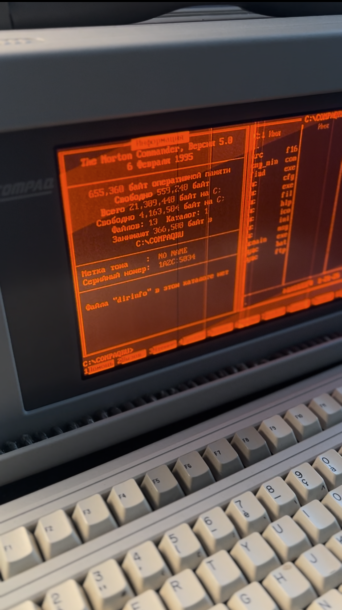

# Compaq Portable II/III Russian Font TSR

This repository contains a **Terminate and Stay Resident (TSR)** program for the **Compaq Portable II/III** running DOS. It installs a custom 8×16 CP866 (Russian) font and reloads it automatically whenever the BIOS sets a new video mode.

## Features

- Loads a custom (Russian) 8×16 CP866 font for DOS text modes.
- Stays resident in memory, hooking **INT 10h**.
- Automatically detects when `AH=0` (set video mode) is called and restores the font.
- Supports text modes: 0, 1, 2, 3, 7, 9 (CGA/EGA text, 40×25 and 80×25).

## System Requirements

- **DOS 2.0+** (or compatible)  
- **Compaq Portable II/III** or a fully compatible machine (especially for the custom BIOS calls).  
- A few kilobytes of conventional DOS memory for the TSR code.  

## How to Build

1. Make sure you have the **YASM** assembler installed.  
2. A sample **Makefile** is included. Simply run:
   ```bash
   make
   ```
   This will assemble the file (`.s` or `.asm`) into a `.com` binary (e.g., `cmp_rle.com`), producing a map file as well.

3. Optionally, `make clean` will remove the `.com` file and map file.

## Usage

1. Copy the generated `.com` file (e.g., `cmp_rle.com`) to your DOS environment.  
2. Run it from the command prompt:
   ```dos
   C:\> cmp_rle
   ```
3. The program installs itself as a TSR, hooking **INT 10h**.  
4. Whenever you change the video mode (via `MODE`, direct `INT 10h` calls, etc.), if it’s a recognized text mode, the TSR automatically re-loads the Russian font.  

## Technical Overview

- On load, the TSR calls **INT 21h/AH=31h** to remain resident.  
- It saves the original interrupt vector **INT 10h**, then replaces it with a custom handler.  
- The custom handler checks if `AH=0` (set video mode). If so, it installs the font via `INT 10h/AH=11h` (and possibly `AH=14h` if needed).  
- This ensures the font gets restored whenever DOS or the BIOS re-initializes the screen.

## Possible Issues

- If insufficient conventional memory is available, the TSR may fail to install or operate properly.  
- Removing the TSR from memory requires either rebooting or using specialized tools like `MARK/RELEASE`.  

## Author

- Dmitry Gerasimuk 
- dmitrygerasimuk@gmail.com

Feel free to open issues or pull requests if you have questions or improvements. Enjoy!
